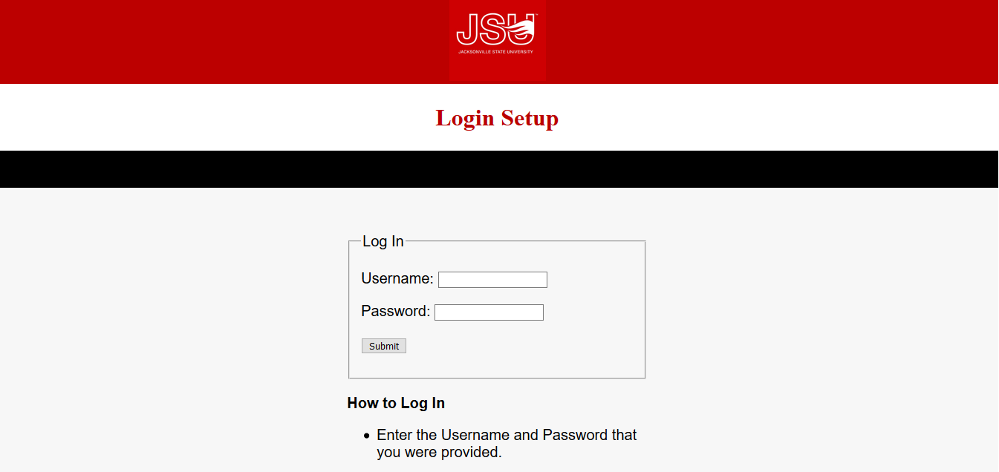
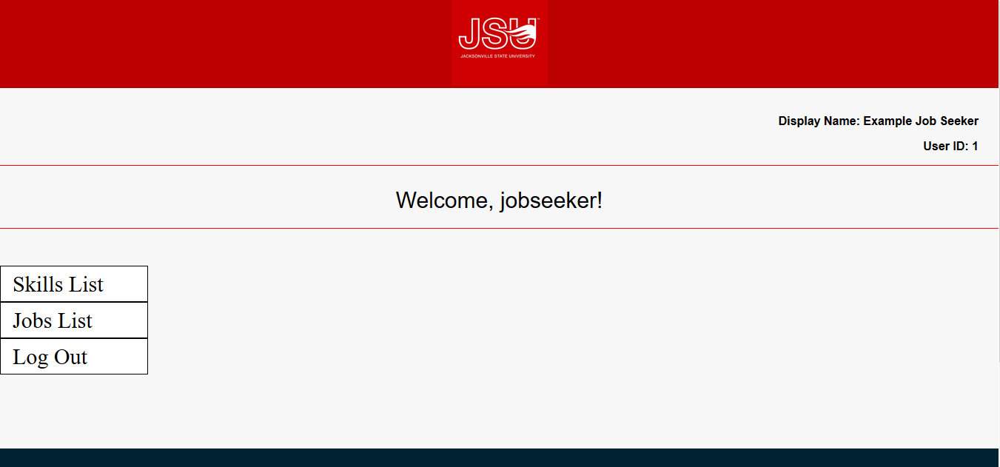
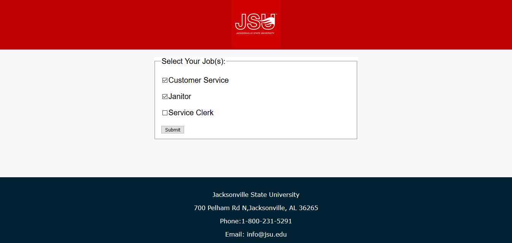

#  Employment Database Application
   It provides an employment portal for the users (students with a special need) via which they can apply for the jobs. The back-end is written in Java (Java Servlets, Java Beans, and Java Server Pages) and JavaScript/jQuery (AJAX) where as the front-end is written in HTML/CSS.
   It was the final project of my CS 425 (Web App Development) class. 
##
## Description
   Once the user launches this application, they are prompted to the login page as shown below,
   
   
   
   After entering the username and password (**Username: jobseeker and Password: jobseeker**), the user is prompted to a page as shown below. They can add and look up the skills and jobs.
   
   
   
   When the user selects the "Skills List", they are prompted to a page as shown below. The user can select their skills, and the skills that are previously selected and stored in the database will automatically be checked.
   
   
   
   Once the user selects the skills and submits, they are prompted to a page with jobs list. The jobs are listed according to the user's skills. The jobs will automatically be checked, if the user's skills matches the skills that are required for the job. This page looks like below,
   
   
   
   Once the user selects the jobs and submits them, the job report is created on fly. The job report is a pdf file which consists student's information, jobs selected, and the skills that the user possess for those jobs.
   
##
## Running this Project
   To run this project, you'll need MySQL, Java (particularly Java 8), Apache Tomcat Server, and Netbeans. Once you have all these required tools, you can clone this repository by running this command,
   ##
                     git clone https://github.com/sbanjara/cs425-project2
   Once this project is cloned in your workstation, you can open  in the Netbeans and run.
  
##
## Configuring the Database for the Database Pooling
   To run this application, you'll need to import the application database (**cs425_p2.sql**). After importing the database, you'll need to create database accounts for it, and grant these accounts the appropriate permissions in MySQL. To do this, please run the following command from an SQL client while logged in to MySQL as root:
 ##
         source C:\USER\Desktop\cs425_p2.sql ( It assumes the location of sql file is in Desktop. It may be different for you.)
         create user 'p2_auth'@'localhost' identified by 'CS425!Project2';
         create user 'p2_user'@'localhost' identified by 'CS425!Project2';
         grant select on cs425_p2.login to 'p2_auth'@'localhost';
         grant select on cs425_p2.user_to_role to 'p2_auth'@'localhost';
         grant all on cs425_p2.* to 'p2_user'@'localhost';
         flush privileges;
 ##
   The **"p2_user"** is for the database pool and **"p2_auth"** is for a restricted account for user authentication while login.
